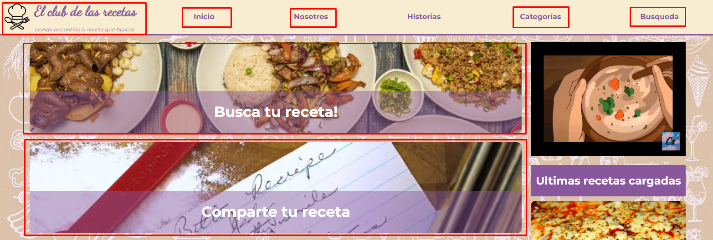

# El club de las recetas
Repositorio para el desarrollo de la pagina web llamada "El club de las recetas" cuya temática es ser un portal de recetas de cocina para buscar recetas, leer historias de recetas y para poder postear recetas o historias.

Esta página web esta bajo desarrollo por:

[Erwin Zambrana](https://github.com/erwinzam)

[Juan Martin Opacak](https://github.com/jopacak)

[Rocio Catalina Martinez](https://github.com/cata-martinez)

[Javier Torres](https://github.com/javiTorres97)

## Observación
- Se ha utilizado la API rest de esta [página](https://www.themealdb.com/api.php) que contiene una base de datos de recetas de comidas con nombre, imagen, ingredientes, video de preparación, etc. En nuestro caso hemos utilizado esta [URL](www.themealdb.com/api/json/v1/1/random.php) que nos da una receta de cocinan random de su base de datos y que esta receta se muestra en el portal del sitio web en la sección de "Receta del día". El script JS que hace esto capaz se encuentra en el path del repositorio como js/fetch_random_recipe.js.
- Hay 5 archivos html que se han desarrollado que los mismos se puede acceder desde el portal del sitio web. En la imagen se abajo se recuadra en rojo los links en funcionamiento que redirecciona a los codigo fuente html trabajados:

- Los links del navegador son todos funcionales excepto el de "Historias". El navegador se comporta asi en todas las páginas web trabajadas.
- Hay links sobre imagenes de receta y categorías que solo te llevan a la misma página donde uno esta.
- El link de la imagen de la sección de la receta del día que figura en el portal esta en funcionamiento y te abre una pestaña a un video de Youtube de como preparar esa receta.
